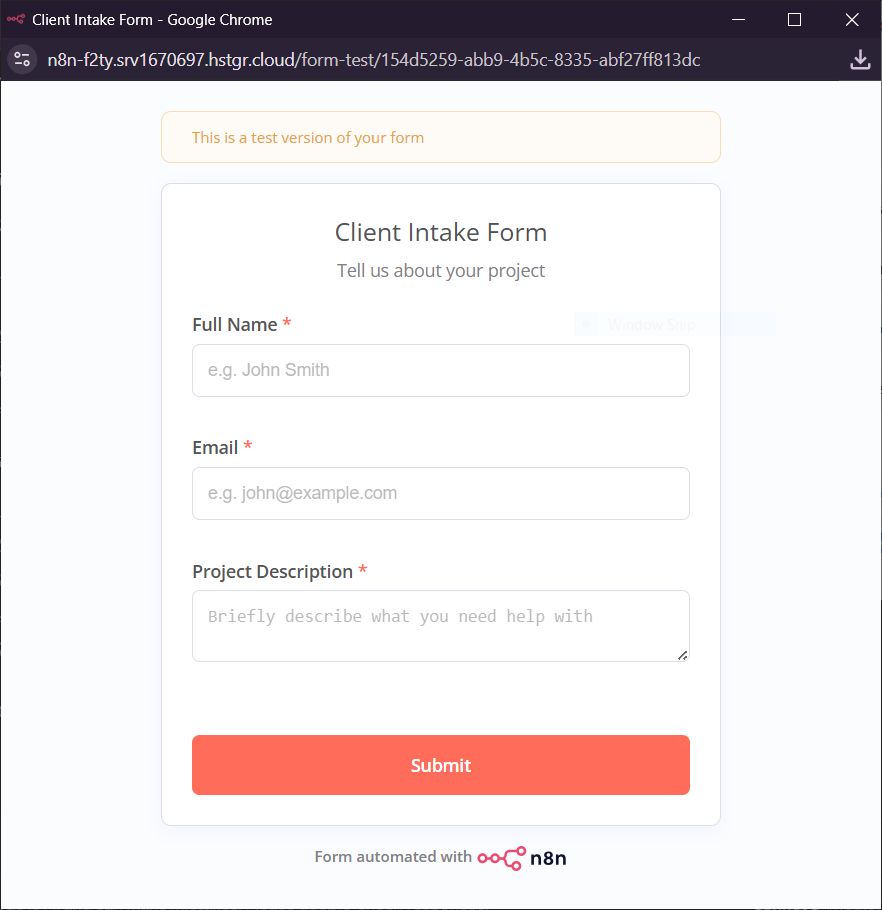
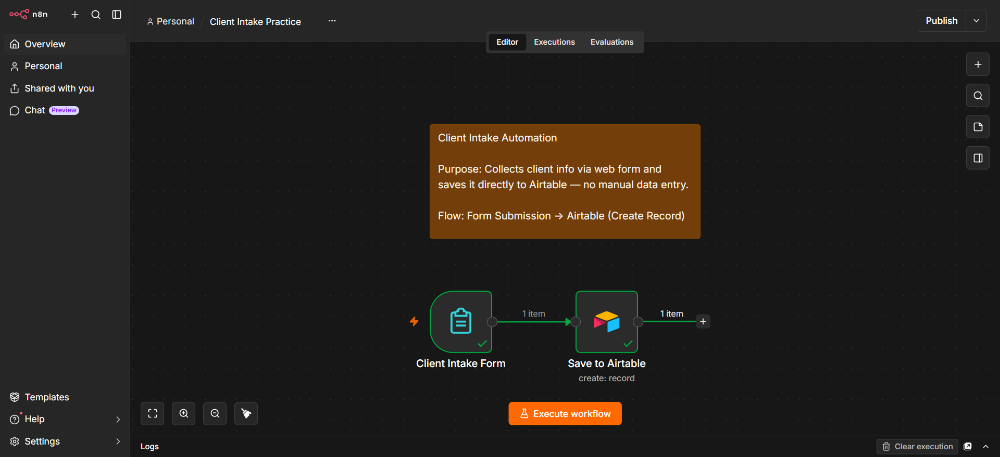
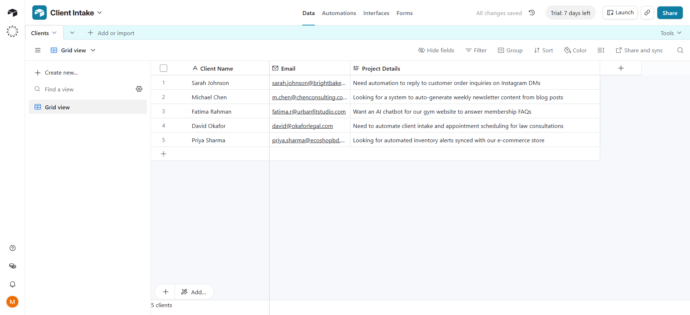

# Client Intake Form → Airtable Automation

## Overview
A lightweight n8n automation that replaces manual client data entry. When a client fills out a web form (name, email, project details), their information is automatically saved to an Airtable database — no copy-pasting required.

## Why This Matters
Freelancers and small businesses often lose time (and leads) manually entering client inquiries into spreadsheets. This workflow captures every submission instantly and reliably, so nothing gets missed.

## How It Works
1. Client fills out a simple web form
2. n8n's Form Trigger captures the submission
3. Data is automatically mapped and saved as a new record in Airtable

## Screenshots

**The intake form:**

**The n8n workflow:**

**Resulting data in Airtable:**

## Tools Used
- **n8n** — workflow automation, form trigger, data mapping
- **Airtable** — structured data storage

## Status
Practice project — demo data used for illustration.
